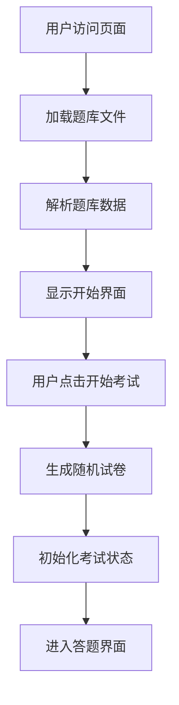
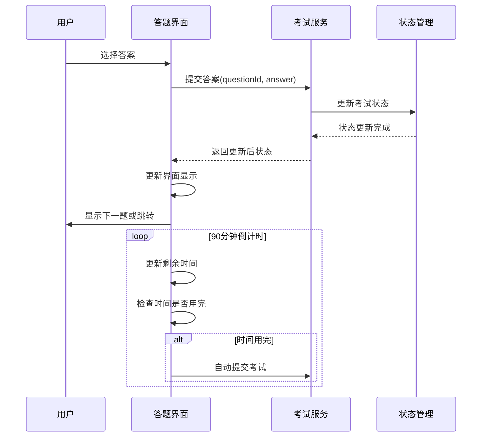
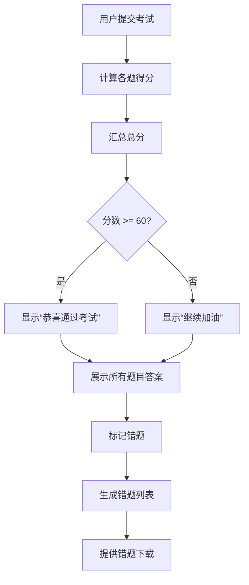

# 架构设计蓝图 (Architecture Blueprint)

## 项目概述
基于《网络安全与信息化知识测试题》需求，设计一个纯前端解决方案，实现题库解析、随机组卷、在线答题、自动评分和错题下载功能。

## 系统架构

### 整体架构
```
┌─────────────────────────────────────────────────────────────┐
│                    前端应用层                              │
├─────────────────────────────────────────────────────────────┤
│  ┌─────────────┐  ┌─────────────┐  ┌─────────────┐      │
│  │   路由层    │  │   组件层    │  │   服务层    │      │
│  │  Router     │  │ Components  │  │  Services   │      │
│  └─────────────┘  └─────────────┘  └─────────────┘      │
├─────────────────────────────────────────────────────────────┤
│                    数据管理层                              │
├─────────────────────────────────────────────────────────────┤
│  ┌─────────────┐  ┌─────────────┐  ┌─────────────┐      │
│  │ 题库解析器  │  │ 状态管理器  │  │ 本地存储    │      │
│  │Parser       │  │StateManager│  │LocalStorage│      │
│  └─────────────┘  └─────────────┘  └─────────────┘      │
├─────────────────────────────────────────────────────────────┤
│                    工具库层                                │
├─────────────────────────────────────────────────────────────┤
│  ┌─────────────┐  ┌─────────────┐  ┌─────────────┐      │
│  │ Word生成器  │  │ 随机算法    │  │ 工具函数    │      │
│  │DocxGenerator│  │RandomUtil   │  │Utils        │      │
│  └─────────────┘  └─────────────┘  └─────────────┘      │
└─────────────────────────────────────────────────────────────┘
```

## 数据模型设计

### 1. 题目数据模型 (JSON Schema)

```json
{
  "$schema": "http://json-schema.org/draft-07/schema#",
  "title": "Question Bank",
  "type": "object",
  "properties": {
    "questions": {
      "type": "array",
      "items": {
        "oneOf": [
          { "$ref": "#/definitions/singleChoice" },
          { "$ref": "#/definitions/trueFalse" },
          { "$ref": "#/definitions/multipleChoice" }
        ]
      }
    }
  },
  "definitions": {
    "singleChoice": {
      "type": "object",
      "properties": {
        "id": { "type": "string" },
        "type": { "type": "string", "enum": ["single"] },
        "category": { "type": "string" },
        "question": { "type": "string" },
        "options": {
          "type": "array",
          "items": { "type": "string" },
          "minItems": 2,
          "maxItems": 6
        },
        "correctAnswer": { "type": "string" },
        "score": { "type": "number", "default": 1 }
      },
      "required": ["id", "type", "question", "options", "correctAnswer"]
    },
    "trueFalse": {
      "type": "object",
      "properties": {
        "id": { "type": "string" },
        "type": { "type": "string", "enum": ["trueFalse"] },
        "category": { "type": "string" },
        "question": { "type": "string" },
        "options": {
          "type": "array",
          "items": { "type": "string", "enum": ["对", "错"] }
        },
        "correctAnswer": { "type": "string", "enum": ["对", "错"] },
        "score": { "type": "number", "default": 1 }
      },
      "required": ["id", "type", "question", "correctAnswer"]
    },
    "multipleChoice": {
      "type": "object",
      "properties": {
        "id": { "type": "string" },
        "type": { "type": "string", "enum": ["multiple"] },
        "category": { "type": "string" },
        "question": { "type": "string" },
        "options": {
          "type": "array",
          "items": { "type": "string" },
          "minItems": 3,
          "maxItems": 8
        },
        "correctAnswer": { "type": "string" },
        "score": { "type": "number", "default": 1.5 }
      },
      "required": ["id", "type", "question", "options", "correctAnswer"]
    }
  }
}
```

### 2. 考试状态模型

```json
{
  "examState": {
    "status": "notStarted|inProgress|completed",
    "startTime": "string",
    "endTime": "string",
    "timeLimit": 90,
    "timeRemaining": "number",
    "currentQuestion": 0,
    "answers": {
      "questionId": {
        "userAnswer": "string|array",
        "isCorrect": "boolean",
        "timestamp": "string"
      }
    },
    "score": {
      "total": "number",
      "singleChoice": "number",
      "trueFalse": "number",
      "multipleChoice": "number"
    },
    "wrongQuestions": ["string"]
  }
}
```

## API接口契约 (前端服务层接口)

### 1. 题库解析服务

```javascript
// 题库解析接口
class QuestionBankService {
  /**
   * 解析Markdown题库文件
   * @param {string} markdownContent - Markdown格式题库内容
   * @returns {Promise<QuestionBank>} 解析后的题库数据
   */
  async parseQuestionBank(markdownContent) {}
  
  /**
   * 随机生成试卷
   * @param {Object} options - 试卷配置
   * @param {number} options.singleCount - 单选题数量
   * @param {number} options.trueFalseCount - 判断题数量
   * @param {number} options.multipleCount - 多选题数量
   * @returns {Promise<ExamPaper>} 生成的试卷
   */
  async generateExamPaper(options) {}
}
```

### 2. 考试管理服务

```javascript
// 考试管理接口
class ExamService {
  /**
   * 开始考试
   * @param {ExamPaper} paper - 试卷数据
   * @returns {Promise<ExamState>} 考试状态
   */
  async startExam(paper) {}
  
  /**
   * 提交答案
   * @param {string} questionId - 题目ID
   * @param {string|array} answer - 用户答案
   * @returns {Promise<ExamState>} 更新后的考试状态
   */
  async submitAnswer(questionId, answer) {}
  
  /**
   * 完成考试
   * @returns {Promise<ExamResult>} 考试结果
   */
  async completeExam() {}
  
  /**
   * 获取考试状态
   * @returns {Promise<ExamState>} 当前考试状态
   */
  async getExamState() {}
}
```

### 3. 文档生成服务

```javascript
// 文档生成接口
class DocumentService {
  /**
   * 生成错题Word文档
   * @param {Array} wrongQuestions - 错题列表
   * @returns {Promise<Blob>} Word文档二进制数据
   */
  async generateWrongQuestionsDoc(wrongQuestions) {}
  
  /**
   * 下载文件
   * @param {Blob} data - 文件数据
   * @param {string} filename - 文件名
   */
  async downloadFile(data, filename) {}
}
```

## 核心流程图

### 1. 系统启动流程



### 2. 答题流程



### 3. 评分和错题处理流程



## 组件交互说明

### 文件结构设计
```
src/
├── components/           # 组件层
│   ├── layout/          # 布局组件
│   │   ├── Header.jsx
│   │   ├── Footer.jsx
│   │   └── Layout.jsx
│   ├── exam/            # 考试相关组件
│   │   ├── StartScreen.jsx      # 开始界面
│   │   ├── ExamScreen.jsx       # 答题界面
│   │   ├── QuestionCard.jsx     # 题目卡片
│   │   ├── Timer.jsx           # 计时器
│   │   ├── QuestionNavigator.jsx # 题目导航
│   │   └── ResultScreen.jsx     # 结果界面
│   └── ui/              # 通用UI组件
│       ├── Button.jsx
│       ├── Card.jsx
│       └── Modal.jsx
├── services/            # 服务层
│   ├── QuestionBankService.js
│   ├── ExamService.js
│   ├── DocumentService.js
│   └── TimerService.js
├── utils/               # 工具函数
│   ├── markdownParser.js
│   ├── randomUtil.js
│   └── validators.js
├── state/               # 状态管理
│   ├── ExamContext.js
│   └── useExamState.js
├── data/                # 数据文件
│   └── questionBank.md
├── styles/              # 样式文件
│   ├── global.css
│   ├── variables.css
│   └── components.css
├── App.jsx
└── index.js
```

### 组件依赖关系
```
App.jsx
├── Layout
│   ├── Header
│   └── Footer
├── StartScreen
├── ExamScreen
│   ├── QuestionCard
│   ├── Timer
│   └── QuestionNavigator
└── ResultScreen
```

### 新增文件清单
- `src/components/` - 所有React组件
- `src/services/` - 业务逻辑服务
- `src/utils/` - 工具函数
- `src/state/` - 状态管理
- `src/styles/` - 样式文件
- `public/data/questionBank.md` - 题库文件

## 技术选型与风险

### 核心技术栈
- **前端框架**: React 18+ (Create React App)
- **状态管理**: React Context + useReducer
- **样式方案**: CSS Modules + CSS Variables
- **文档生成**: docx.js
- **Markdown解析**: 自研解析器
- **构建工具**: Webpack (CRA内置)

### 关键依赖库
```json
{
  "dependencies": {
    "react": "^18.2.0",
    "react-dom": "^18.2.0",
    "docx": "^8.5.0",
    "file-saver": "^2.0.5"
  },
  "devDependencies": {
    "@types/react": "^18.2.0",
    "@types/react-dom": "^18.2.0"
  }
}
```

### 技术风险评估

#### 高风险项
1. **Markdown题库解析复杂性**
   - 风险：题库格式可能存在不一致
   - 缓解：设计健壮的解析器，支持多种格式变体

2. **Word文档生成兼容性**
   - 风险：不同浏览器对文件下载支持不同
   - 缓解：使用成熟的docx.js库，提供多种下载方式

#### 中风险项
1. **响应式布局适配**
   - 风险：手机端和电脑端体验差异
   - 缓解：采用移动优先设计，充分测试各种设备

2. **大规模数据渲染性能**
   - 风险：90道题目一次性渲染可能影响性能
   - 缓解：实现虚拟滚动，分页渲染

#### 低风险项
1. **状态管理复杂度**
   - 风险：考试状态管理可能变得复杂
   - 缓解：使用标准化的状态管理模式

### 性能优化策略
1. **代码分割**: 按路由分割代码块
2. **懒加载**: 非关键组件懒加载
3. **缓存策略**: 题库数据本地缓存
4. **内存管理**: 及时清理不需要的考试数据

## 部署方案

### 静态部署
- 构建产物：纯静态文件
- 部署环境：任何支持静态文件的服务器
- CDN支持：可配置CDN加速

### 环境要求
- Node.js >= 16 (开发环境)
- 现代浏览器 (Chrome 80+, Firefox 75+, Safari 13+)

---

**架构师**: Claude AI Assistant  
**设计时间**: 2025-09-02  
**版本**: v1.0